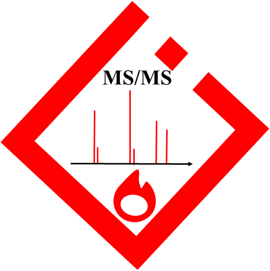

# IDSL_MINT
<!-- badges: start -->

<!-- badges: end -->

**IDSL_MINT: Mass spectra INTerpretation** by the [**Integrated Data Science Laboratory for Metabolomics and Exposomics (IDSL.ME)**](https://www.idsl.me) is a transformative mass spectrometry data processing framework. This innovative approach for mass spectrometry data processing has been constructed upon the transformer models delineated in the seminal paper, [*'Attention is all you need'*](https://arxiv.org/abs/1706.03762). **IDSL_MINT** has been meticulously engineered to predict molecular fingerprints and structures from MS/MS spectra in addition to forecasting MS/MS spectra from canonical SMILES. A key distinguishing feature of **IDSL_MINT** is its compatibility with any reference MS/MS data in ***.msp*** format to tailor **IDSL_MINT** models for various applications.

# Installation

1. Installation of Prerequisites:
    
    a. Install [PyTorch](https://pytorch.org/get-started/locally) according to your system configurations. **IDSL_MINT** is device-agnostic and fully supports `cuda` GPU processing.

    b. Install [RDKit](https://www.rdkit.org/docs/Install.html).

2. Install the package:

	2.1. Option 1: `pip`
	
	- `pip install git+https://github.com/idslme/IDSL_MINT`
	- `pip install IDSL_MINT`
    
	2.2. Option 2: `conda`

	- `git clone https://github.com/idslme/IDSL_MINT.git`
	- `cd IDSL_MINT`
	- `conda env create -f environment.yml`
	- `conda activate IDSL_MINT`
	- `pip install -e .`

3. Update the Python PATH:

	`export PATH="root/.local/bin:$PATH"` --> root directory should be your system root directory.

# Workflow
The **IDSL_MINT** framework encapsulates three transformative approaches to deeply interpret mass spectrometry data. Each of these methodologies can be effectively managed using designated model configuration `yaml` files. In the training step, weights of **IDSL_MINT** models are stored and updated in a designated directory on the decreasing trajectory of the training loss value to ensure optimal performance and accuracy. The [`yaml`](https://github.com/idslme/IDSL_MINT/tree/main/YAML) files are easy to update and model configuration is significantly simplified and commented. After configuring the model in the designated `yaml` file, run the below bash command to perform calculations. The **IDSL_MINT** package can automatically detect types of `yaml` file to run training or inference operations.

    MINT_workflow --yaml /path/to/yaml/file

### Important tips:
- **IDSL_MINT** can extract information from `comment: ` and `comments: ` entries in ***.msp*** files which enables this platform to process MoNA, GNPS, and other public library with any pre-treatment requirements.

- **IDSL_MINT** identifies chemical structures through `SMILES: ` or `InChI: ` labels without case sensitivity.

- In case multiple similar headers are present in a MSP block, the one with the longest content is selected for parsing.

- MSP blocks must include `PrecursorMZ: ` row entries.

## IDSL_MINT: Translating MS/MS Spectra into Molecular Fingerprints
**IDSL_MINT** includes a method to translate MS/MS spectra into molecular fingerprints. This method offers the option to calculate fingerprints using the [Extended-connectivity fingerprints (ECFPs)](https://doi.org/10.1021/ci100050t) or [MACCS Keys](https://doi.org/10.1021/ci200081k) RDKit methods from InChI and SMILES row entries. Another option to obtain molecular fingerprints is to parse the MSP files for the user-provided fingerprints. The following is an example of an Aspirin MSP block with custom fingerprint bits.

    Name: Aspirin
    Fingerprint: 15-53-85-157-246-322-329-343-444-464-553-708-763-785-799-821-847-1040-1139-1240-1250-1317-1348-1439-1450-1460-1475-1479-1502-1674-1693-1734-1841-1866-2046-2310-2329-2413-2627-2750-2755-2777-2782-2799-2901-2911-2915-3028-3049-3394-3412-3442-3514-3535-3557-3700-3737-3785-3972-3996
    Synon: Acetyl salicilic acid
    Synon: 2-acetyloxybenzoic acid
    InChI: InChI=1S/C9H8O4/c1-6(10)13-8-5-3-2-4-7(8)9(11)12/h2-5H,1H3,(H,11,12)
    Precursor_type: [M+H]+
    Spectrum_type: MS2
    PrecursorMZ: 181.0495
    Instrument_type: LC-ESI-QFT
    Instrument: Q Exactive Plus Orbitrap Thermo Scientific
    Ion_mode: P
    Collision_energy: 15 (nominal)
    Formula: C9H8O4
    MW: 180
    ExactMass: 180.042258736
    Num Peaks: 10
    65.0385 0.217327
    76.0304 0.107699
    77.0383 0.124517
    92.0255 0.129908
    121.0283 0.125197
    133.028 0.149192
    149.0231 100.000000
    163.0386 63.824575
    167.0337 0.261816
    181.0493 0.613766

`Fingerprint` row entries may be in any line in MSP blocks between `Name` and `Num Peaks` rows, and fingerprint bits must be dash-separated. This example represented Avalon fingerprint bits with `nBits = 4096` for Aspirin MS/MS spectra.

To train an **IDSL_MINT** model with molecular fingerprints, download and fill a [MINT_MS2FP_trainer.yaml](https://github.com/idslme/IDSL_MINT/tree/main/YAML/MINT_MS2FP_trainer.yaml) file. Similarly, for model prediction, use [MINT_MS2FP_predictor.yaml](https://github.com/idslme/IDSL_MINT/tree/main/YAML/MINT_MS2FP_predictor.yaml) file.

A [colab notebook](https://colab.research.google.com/drive/16A-Hw6S_04nxlopp7yefZkVB5Aakcodu#scrollTo=E4o1pG-tZNDR) was presented to demonstrate the performance of **IDSL_MINT** in training and predicting molecular fingerprint descriptors using MS/MS data.

## IDSL_MINT: Translating MS/MS Spectra into Canonical SMILES

In this approach, InChI and SMILES row entries in the MSP blocks are converted into canonical SMILES using [RDKit](https://www.rdkit.org). Next, standard canonical SMILES are tokenized using a method similar to [RXNFP](https://rxn4chemistry.github.io/rxnfp). As long as InChI and SMILES row entries present in the MSP blocks are available, this approach may be used to train an **IDSL_MINT** model.

To train an **IDSL_MINT** model to predict molecular structures from MS/MS spectra, download and fill a [MINT_MS2SMILES_trainer.yaml](https://github.com/idslme/IDSL_MINT/tree/main/YAML/MINT_MS2SMILES_trainer.yaml) file. Likewise, for model prediction, use [MINT_MS2SMILES_predictor.yaml](https://github.com/idslme/IDSL_MINT/tree/main/YAML/MINT_MS2SMILES_predictor.yaml) file.

A [colab notebook](https://colab.research.google.com/drive/1UUZwCpI4b0adHZ3y4JTRDPlin-KAWIvQ#scrollTo=RbAS-ZFPVOqM) was presented to demonstrate the performance of **IDSL_MINT** in training and predicting canonical SMILES using MS/MS data.

## IDSL_MINT: Transforming Fingerprints into MS/MS Fragments

This method is designed to translate fingerprints into MS/MS fragments using a transformer model. This approach contrasts with previous methods that predict fragment mass from fingerprints. 

To train an **IDSL_MINT** model to predict MS/MS spectra from molecular structures, download and fill a [MINT_FP2MS_trainer.yaml](https://github.com/idslme/IDSL_MINT/tree/main/YAML/MINT_FP2MS_trainer.yaml) file. Likewise, for model prediction, use [MINT_FP2MS_predictor.yaml](https://github.com/idslme/IDSL_MINT/tree/main/YAML/MINT_FP2MS_predictor.yaml) file.

# Citation
Pending ...